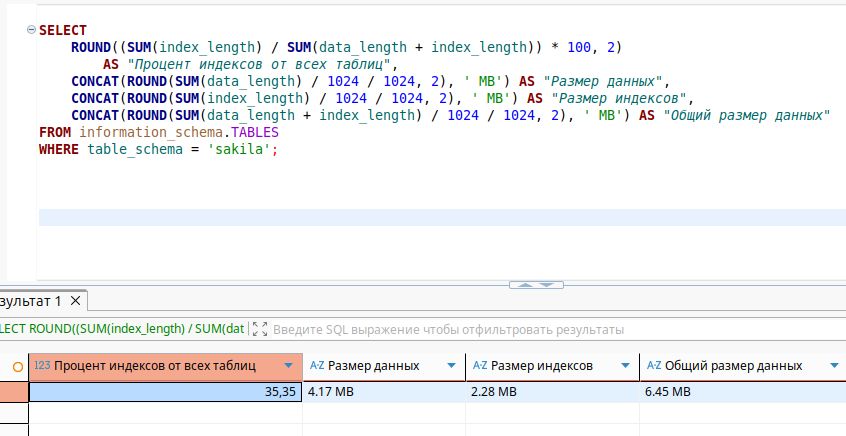
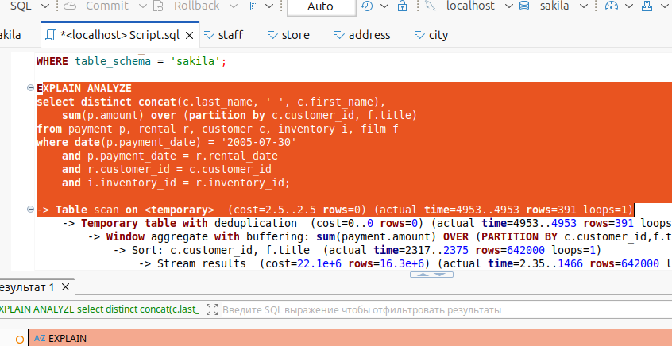
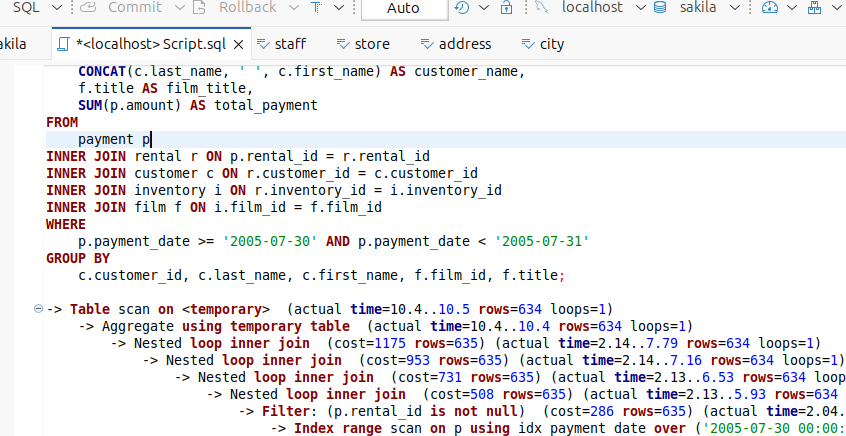

# Домашнее задание к занятию «Index» Шелухин Юрий

### Задание 1.

Напишите запрос к учебной базе данных, который вернёт процентное отношение общего размера всех индексов к общему размеру всех таблиц.
 
---

#### Решение.

1.1. Запустим MYSQL в контейнере Docker-compose.

`docker-compose up -d`

1.2. Выполним запрос по условию задания.

`SSELECT 
    ROUND((SUM(index_length) / SUM(data_length + index_length)) * 100, 2)
    	AS "Процент индексов от всех таблиц",
    CONCAT(ROUND(SUM(data_length) / 1024 / 1024, 2), ' MB') AS "Размер данных",
    CONCAT(ROUND(SUM(index_length) / 1024 / 1024, 2), ' MB') AS "Размер индексов",
    CONCAT(ROUND(SUM(data_length + index_length) / 1024 / 1024, 2), ' MB') AS "Общий размер данных"
FROM information_schema.TABLES
WHERE table_schema = 'sakila';` 



---
 

### Задание 2.

Выполните explain analyze следующего запроса:
```sql
select distinct concat(c.last_name, ' ', c.first_name), sum(p.amount) over (partition by c.customer_id, f.title)
from payment p, rental r, customer c, inventory i, film f
where date(p.payment_date) = '2005-07-30' and p.payment_date = r.rental_date and r.customer_id = c.customer_id and i.inventory_id = r.inventory_id
```
- перечислите узкие места;
- оптимизируйте запрос: внесите корректировки по использованию операторов, при необходимости добавьте индексы.

---

#### Решение.

Выполним запрос для по условию задания.

`EXPLAIN ANALYZE
select distinct concat(c.last_name, ' ', c.first_name),
	sum(p.amount) over (partition by c.customer_id, f.title)
from payment p, rental r, customer c, inventory i, film f
where date(p.payment_date) = '2005-07-30'
	and p.payment_date = r.rental_date
	and r.customer_id = c.customer_id
	and i.inventory_id = r.inventory_id;`   

Получим плохие результаты:  
(cost=2.5..2.5 rows=0) - оценка оптимизатора - Очень низкая стоимость (от начала до конца операции), 
rows=0: Оптимизатор ожидал 0 строк - это указывает на проблему с оценкой кардинальности.  

(actual time=4953..4953 rows=391 loops=1) - реальные показатели.  
actual time=4953..4953: Операция заняла ~4.95 секунд, rows=391: Фактически вернулось 391 строка, loops=1: Операция выполнилась один раз.

Проблемы: ожидалось 0 строк, получено - 391, 4.95 секунды для обработки всего 391 строки - это очень медленно.
Временная таблица создает значительные накладные расходы.



В запросе присутствуют узкие места:  
Отсутствие JOIN с film.	Таблица film не соединена с другими, создает декартово произведение	и резкий рост  обрабатываемых строк.  
Использование функции DATE(p.payment_date) обходит индексы.  
Полное сканирование таблицы (Seq Scan) вместо поиска по индексу.  
DISTINCT пытается удалить дубликаты после расчета SUM() OVER, что создает	избыточные вычисления и необходимость во временной таблице.

Создадим индексы
`CREATE INDEX idx_payment_date ON payment(payment_date);
CREATE INDEX idx_rental_rental_date ON rental(rental_date);
CREATE INDEX idx_rental_customer_id ON rental(customer_id);
CREATE INDEX idx_inventory_id ON inventory(inventory_id);
CREATE INDEX idx_film_id ON film(film_id);`

Модифицируем запрос и проанализируем его.   

`EXPLAIN ANALYZE
SELECT 
    CONCAT(c.last_name, ' ', c.first_name) AS customer_name,
    f.title AS film_title,
    SUM(p.amount) AS total_payment
FROM 
    payment p
INNER JOIN rental r ON p.rental_id = r.rental_id
INNER JOIN customer c ON r.customer_id = c.customer_id
INNER JOIN inventory i ON r.inventory_id = i.inventory_id
INNER JOIN film f ON i.film_id = f.film_id
WHERE 
    p.payment_date >= '2005-07-30' AND p.payment_date < '2005-07-31'
GROUP BY 
    c.customer_id, c.last_name, c.first_name, f.film_id, f.title;`

 Время выполнения сократилось в 45 раз.  

 

---


### Задание 3*.

Самостоятельно изучите, какие типы индексов используются в PostgreSQL. Перечислите те индексы, которые используются в PostgreSQL, а в MySQL — нет.

---

#### Решение.

PostgreSQL предлагает богатый набор специализированных типов индексов, которые отсутствуют в MySQL и позволяют эффективно работать со сложными данными и специфичными запросами, например:  
GIN - Generalized Inverted Index (Обобщенный обратный индекс). Полнотекстовый поиск, массивы, JSON-данные (jsonb), сложные типы данных.  
GiST - Generalized Search Tree (Обобщенное дерево поиска). Геометрические данные, географические объекты, диапазоны, полнотекстовый поиск. Может быть расширен для поддержки пользовательских типов данных.  
SP-GiST - Space-Partitioned GiST (Пространственно-разделенный GiST). Эффективная индексация неоднородных данных с пространственным разделением, таких как деревья квадрантов (quad-trees) или k-D деревья.  
BRIN - Block Range Index (Индекс диапазонов блоков). Очень большие таблицы, где данные физически упорядочены (например, данные временных рядов). Занимает значительно меньше места, чем B-Tree.  
Hash - Хэш-индекс. Точное сравнение, в современных версиях PostgreSQL безопасен для использования.

MySQL в основном опирается на B-Tree (и его вариации) и R-Tree (для пространственных данных), но не имеет аналогов перечисленным выше специализированным индексам PostgreSQL.  

---

